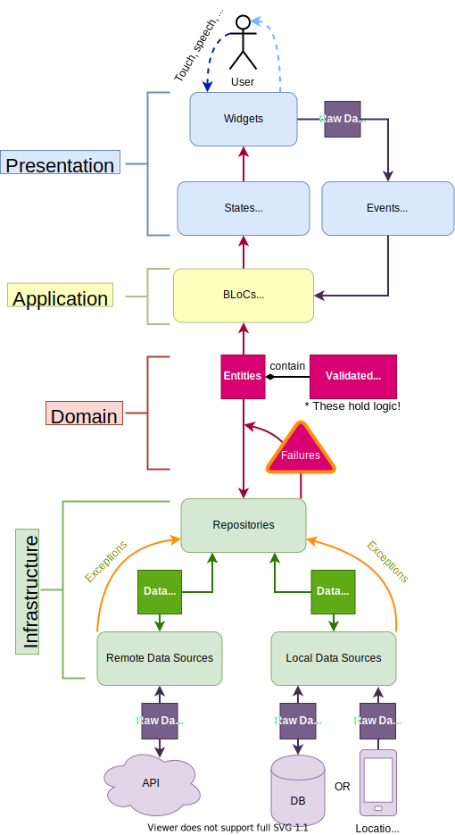

#  Notes App Domain Driven Design Architecture

This project was generated with [Flutter](https://flutter.dev/) 

### Prerequisites

What things you need to install the software and how to install them

```
Flutter [https://flutter.dev/docs/get-started/install]
```

# Development

Reccomended - Emulator(API level any)





## Built With

* [Flutter](http://flutter.dev/) - The web framework used
* [Freezed](https://pub.dev/packages/freezed) 
* [Injectable](https://pub.dev/packages/injectable) - Dependency Injection
* [Firebase](https://circleci.com/) - Backend database

 

## Further Help

FlutterDevs[FlutterDocs](https://flutter.dev/docs)

## Author

* **Author Name** - *Initial work* - [ferdinandmwal](https://github.com/ferdinandmwal123)

See also the list of [contributors](https://github.com/your/project/contributors) who participated in this project.
> Author Name

## Description

An app that lets you create notes with todos & edit them (CRUD) over the web


## License

[](http://opensource.org/licenses/MIT)
This project is licensed under the MIT license.

## Acknowledgements

* Hat tip to ResoCoder


 
